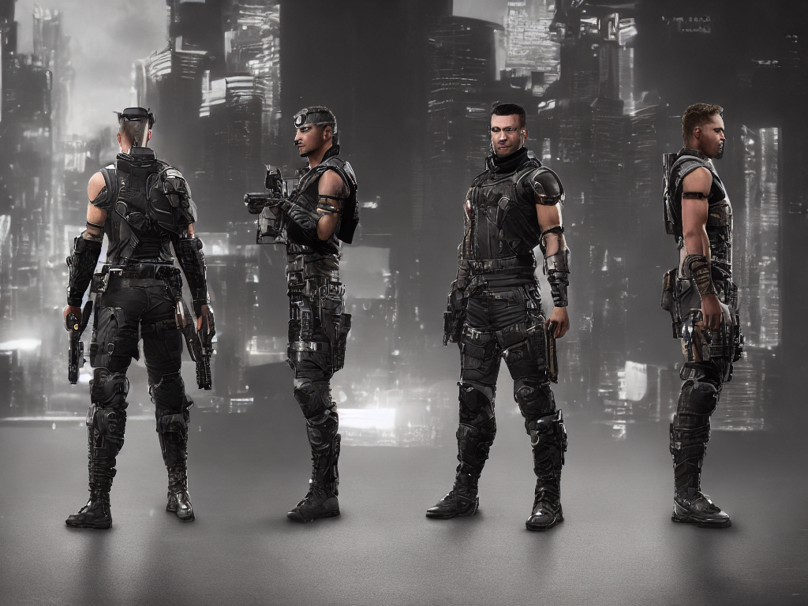
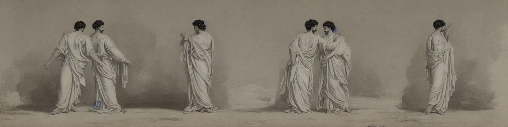

# Lightfusion: Text to 3D Character Reconstruction using Stable Diffusion and LFNs

## Motivation

Text to 3D models have recently enjoyed great success, from [Dreamfusion](https://dreamfusion3d.github.io/) to its open-source alternative [Stable Dreamfusion](https://github.com/ashawkey/stable-dreamfusion) and the newly released [Prolific Dreamer](https://ml.cs.tsinghua.edu.cn/prolificdreamer/). Despite the usefulness and quality of the 3D reconstructions generated by these models, they suffer from very long rendering times - for example, "hours of time" according to the [Prolific Dreamer paper](https://arxiv.org/pdf/2305.16213.pdf). These long rendering times limit these models' broader use. Indeed, there seems to be a tradeoff between quality and computational speed when it comes to the rendering process of text to 3D models. One of the main reasons for this tradeoff is the use of neural radiance fields (NERFs) to generate tridimensional scene representations. NERFs are volumetric-based rendering techniques that rely on ray marching to encode both color and density at any point in space. When coupled with a method of distilling large-scale text-to-image diffusion models - such as [Score Distillation Sampling](https://arxiv.org/abs/2310.17590) or, more broadly, [Variational Score Distillation](https://ml.cs.tsinghua.edu.cn/prolificdreamer/), they have enabled detailed tridimensional scene reconstructions by sampling more heavily on points that contribute more to the object's appearance. Nonetheless, the lengthy rendering time associated with these methods have limited their use, raising the possibility of using different and faster reconstruction methods. One such promising technique, proposed by [Sitzmann and Rezchikov et al. (2021)](https://www.vincentsitzmann.com/lfns/) is called a Light Field Network (LFN). Instead of encoding a scene in 3D space with ray casting, LFNs "encode a scene by directly mapping an oriented camera ray in the four dimensional space of light rays to the radiance observed by that ray" (as stated on the [LFN paper](https://arxiv.org/abs/2106.02634)), reducing rendering time by three orders of magnitude compared to volumetric methods, albeit without the granular level of detail achieved by using a sampling method coupled with a NERF.
Nonetheless, with an efficient tridimensional reconstruction method (LFN) and an openly available text to image diffusion model (Stable Diffusion), it is possible to render 3D representations of characters generated through text in a shorter time. This is further supported by the use of ControlNet and CharTurner, which respectively serve as additional neural network parameters and as a textual inversion tool. They help render the characters generated by Stable Diffusion in different poses with CharTurner not even altering the underlying diffusion model. These poses and novel character views are then used to generate training and reconstruction data that will be used by the LFN during the 3D reconstruction process. Together, Stable Diffusion, ControlNet, CharTurner, and LFNs allow for novel tridimensional character views to be generated from a text prompt, enabling text to 3D reconstruction. This project serves as a coarse attempt made by a college student with an MPS-based machine at generating text to 3D character views, and should be further refined and fine-tuned for industrial applications. It seeks to provide a useable and bug-free basic framework that can power future LFN-based tridimensional view synthesis.

## Functionality

- During training: main.py calls sd.py to generate the images specified by the prompt. Each image depicts the same character in 4 different poses (front, back, 90 clockwise, 90 counterclockwise) and in a blank background. These images, poses, and intrinsic camera parameters are stored in an HDF5 file that is then used as an input to the LFN. The LFN is then trained to infer the light field of the instances generated, learning both their appearance and geometry.
- During reconstruction and testing: The last image generated during the training process is reconstructed by the LFN. The LFN also compares its reconstructed images to the ground truth ones provided by Stable Diffusion and evaluates its success using the PSNR and SSIM metrics.

## Code Structure

- main.py → this is the main file in the project. It creates an instance of the Trainer class available on training.py, trains the model, generates a reconstruction, and evaluates the model using the PSNR and SSIM metrics. main.py also includes a lot of important parameters used by the model -- such as epochs of training and number of images generated.
- sd.py → this file generates the text to 2D images using Stable Diffusion. To generate the same character in multiple positions, it uses [ControlNet](https://github.com/lllyasviel/ControlNet) and [CharTurner](https://civitai.com/models/3036/charturner-character-turnaround-helper-for-15-and-21)
- promptStyles.py → This file contains styles that can be passed into the Stable Diffusion model to change the style of the images generated (from pastel-looking to futuristic). Feel free to edit and include your own style, which is included in the Stable Diffusion image generation prompt.
- hdf5_dataio → This file processes the image inputs generated by Stable Diffusion and then stored in an HDF5 file. Like other files (such as geometry.py and hyperlayers.py), it is a modified version of the corresponding LFN files available on [this repo](https://github.com/vsitzmann/light-field-networks/tree/master?tab=readme-ov-file). hdf5_dataio is used to process the HDF5 files that store the images generated by Stable Diffusion and then pass them into the LFN model
- models.py → This file contains the model architecture used by the LFN and also available on the original LFN repo.
- util.py → contains important functions called by other files
- textual_inversion → this folder contains the CharTurner textual inversion tool and the poses.png file used to guide the diffusion model on what character poses should be generated.

## Usage

```
# For training:
python main.py --prompt="A greek god with a white robe" --num_images=30 --train="true"

# For reconstruction and testing (use the same prompt):
python main.py --prompt="A greek god with a white robe" --train="false"
```

Example images generated:

- A cyberpunk mercenary:
  </br>
  
- A greek god in a white robe:
  

As you can see from these images, the Stable Diffusion model outputs can be further improved, and it was observed during training that higher image dimensions yield better outputs. One potential improvement here is using a CharTurner-like textual inversion tool for Stable Diffusion XL instead of Stable Diffusion 1.5, which is a smaller and less potent model.

Furthermore, during the 3D reconstruction process using the images generated by the Stable Diffusion model, I observed that the silhouette of the images produced was being captured by the LFN, but the LFN did not include fine-grained details about faces and hands or feet. I am certain that this is because, as a college student with limited computational resources, I trained the model locally using MPS instead of on a potent NVIDIA GPU that uses CUDA. If that were the case, a greater number of epochs could be used (50k, as included in the main.py file) instead of the mere 1000 epochs that I used. For example, the authors of the LFN paper used an NVIDIA RTX 6000 GPU trained over three days. Furthermore, with a more potent hardware it is also possible to generate a greater number of images using Stable Diffusion (100 instead of 10) and in other poses (not just the 4 poses specified by the poses.png file under textual_inversion/), generating much better and more detailed results. To use more poses, edit the poses.png file to include different positions and change the "rotations" list on sd.py to account for the x, y, and z rotations associated with each of them.

## Potential Applications

Although this implementation is highly experimental and should undergo significant improvement before real-world usage, the text to 3D reconstruction supported by this method can power applications in:

- 3D mesh creation for gaming and virtual simulations (using a graphics tool like Blender or a second machine learning model)
- 3D character conceptualization for artists and designers
- 3D video / animation creation using characters created from text, and others.

## Limitations and Further Improvement

- On the intrinsics.txt generation function in the sd.py file, I rely on the assumption that the field of view (FOVY) = 45 degrees to obtain a focal length that would be able to capture the full body of a character without zooming in excessively or including surrounding details. However, this is just a prior that can adjusted to more accurately reflect the images generated by Stable Diffusion, which in reality does not use a camera to capture images.
- The original LFN paper demonstrates the model being trained on chairs and cars, as opposed to anthropomorphic characters. This is likely due to the fact that the absence of a distillation model like Variational Score Distillation prevents the LFN from capturing very fine-grain details of a scene like NERF. This lower quality, however, comes with a much faster rendering time.
- The prompt and negative prompts used can be further modified for better Stable Diffusion outputs (for example, by assigning weights to what is considered more important for the model to capture, like "(hair color: 2)", where 2 = weight given to "hair color")
- Priors can be used to construct the top and bottom views of the characters, since Stable Diffusion is currently not good at generating views from these positions.

## Thanks

- Sitzmann and Rezchikov et. al, for the incredible work on LFNs available [here](https://www.vincentsitzmann.com/lfns/).
- Creators of the Stable Diffusion 1.5 model available [here](https://huggingface.co/runwayml/stable-diffusion-v1-5)
- CivitAI creators of the [CharTurner tool](https://civitai.com/models/3036/charturner-character-turnaround-helper-for-15-and-21)
- [ControlNet](https://github.com/lllyasviel/ControlNet) creators and contributors
